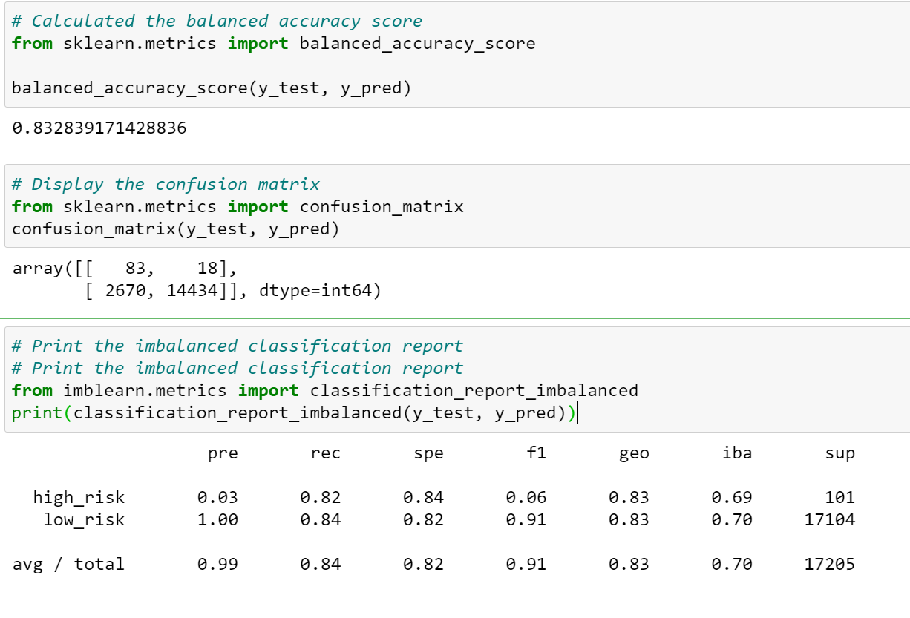
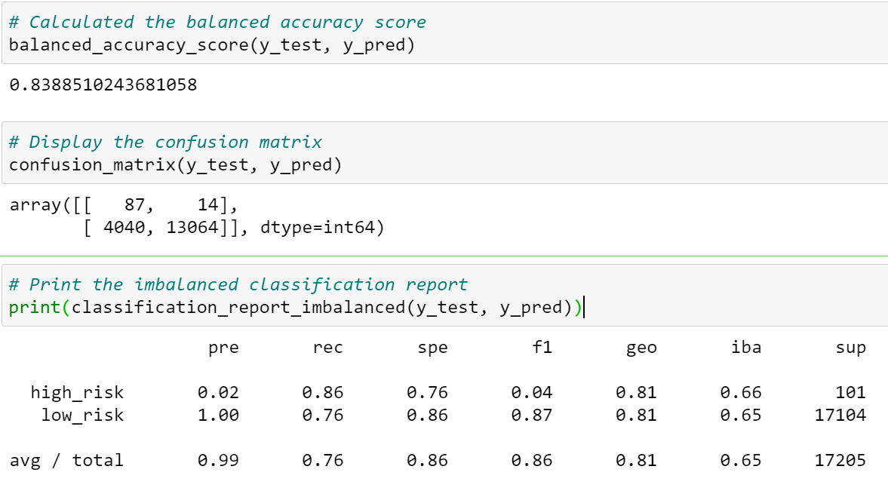
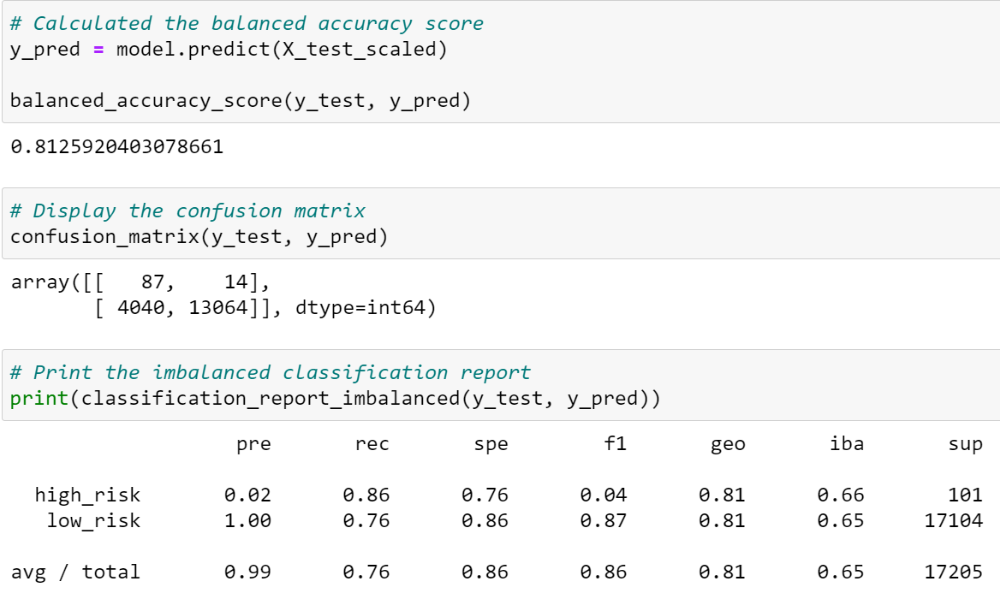
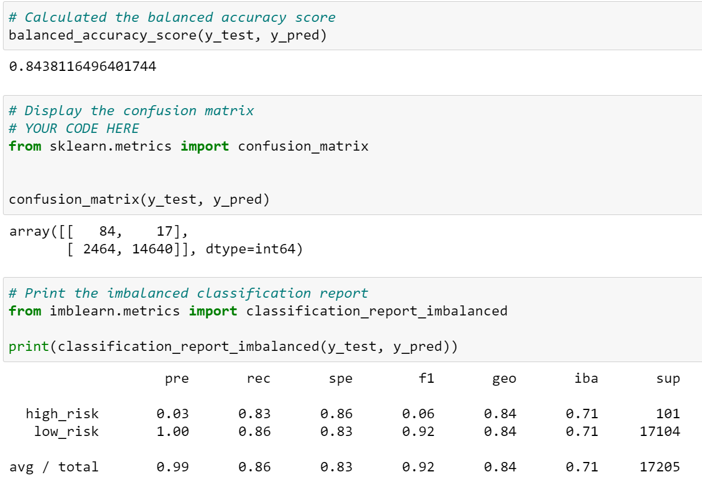
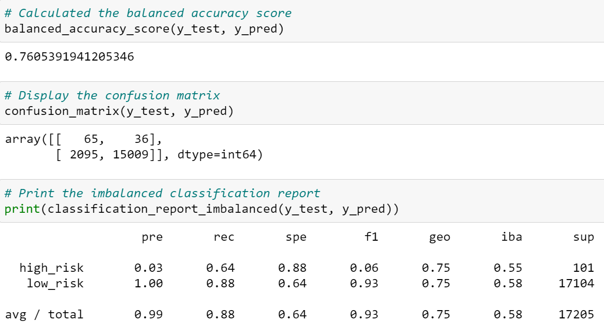

# Credit_Risk_Analysis

## Overview of the analysis

In this challenge, we are tasked with creating a credit risk predictive model using machine learning that can provide a quicker and reliable loan experience for a company called LendingClub, a peer-to-peer lending services company. The goal of such a model is to accurately identify good candidates for loan and lower default rates.

Since credit risk is an unbalanced classification problem, we will be using different techniques/algorithms to train and evaluate models using imbalanced-learn and scikit-learn libraries. Finally, we will analyze the performance of these models to recommend the best fit model and/or justify reasoning.

 

## Resources
- **Images:** "resources" folder
- **Code files:** 
    - credit_risk_resampling.ipynb
    - credit_risk_ensemble.ipynb
- **Data file:** LoanStats_2019Q1.csv

 

## Results

In this section, we will evaluate performance metrics of models produced using different algorithms:

 

**Naive Random Oversampling**
- Balanced Accuracy Score = 0.832839171428836
- Precision:
    - High Risk = 0.03
    - Low Risk = 1.00
- Recall/Sensitivity:
    - High Risk = 0.82 
    - Low Risk = 0.84

  

     

**SMOTE Oversampling**
- Balanced Accuracy Score = 0.8388510243681058
- Precision:
    - High Risk = 0.02
    - Low Risk = 1.0
- Recall/Sensitivity:
    - High Risk = 0.86
    - Low Risk = 0.76

  

     

**Undersampling**
- Balanced Accuracy Score = 0.8125920403078661
- Precision:
    - High Risk = 0.02
    - Low Risk = 1.00
- Recall/Sensitivity:
    - High Risk = 0.86
    - Low Risk = 0.76

 

     

**SMOTEENN**
- Balanced Accuracy Score = 0.8438116496401744
- Precision:
    - High Risk = 0.03
    - Low Risk = 1.00
- Recall/Sensitivity:
    - High Risk = 0.83
    - Low Risk = 0.86

  

     

**Balanced Random Forest Classifier**
- Balanced Accuracy Score = 0.7605391941205346
- Precision:
    - High Risk = 0.03
    - Low Risk = 1.00
- Recall/Sensitivity:
    - High Risk = 0.64
    - Low Risk = 0.88

  

     

**Easy Ensemble AdaBoost Classifier**
- Balanced Accuracy Score = 0.9351680227657939
- Precision:
    - High Risk = 0.10
    - Low Risk = 1.00
- Recall/Sensitivity:
    - High Risk = 0.92
    - Low Risk = 0.95

  

     

## Summary

For this credit risk analysis, we can infer that it is of utmost importance to accurately predict high/low risk loans to lower default rates. This indicates that a model with a higher precision will be ideal to correctly identify high risk loans.

For all sampling algorithms conducted in this exercise, even though the accuracy score is above 80% and it perfectly predicts low-risk loans, precision of high-risk loans is very poor. This highlights that sampling can attempt to address imbalance but it does not always produce better results.

From ensemble library, we see slightly better precision (0.1) than other models for high-risk loans when using "Easy Ensemble AdaBoost Classifier" with accuracy score above 93%, but the overall precision of the metrics to predict high risk loans remains very low and not enough to recommend this model. Further analysis is needed using other algorithms and review of the deficiencies of the original dataset to make an appropriate model recommendation.
